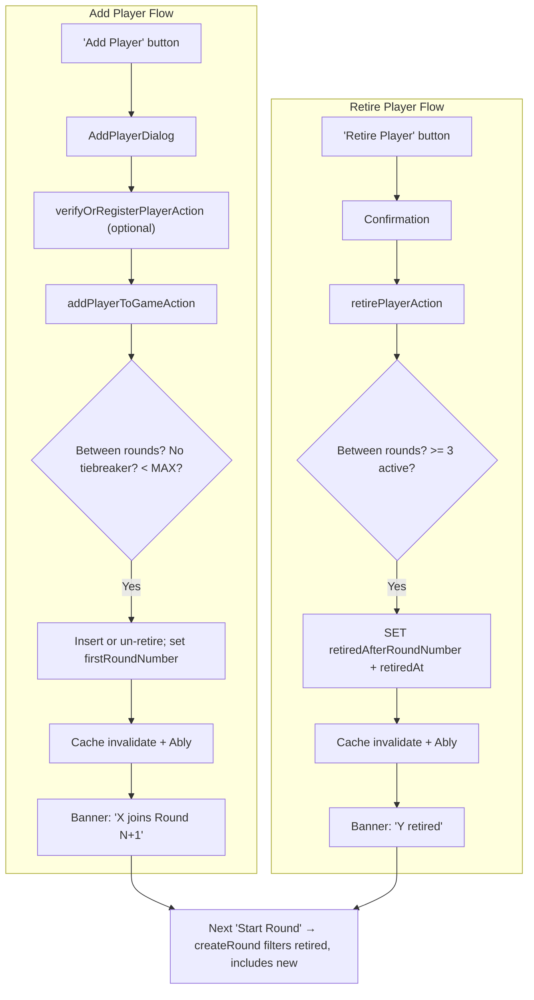

# Add and Retire Players Between Rounds

Two complementary features: adding new players to a game session and retiring existing players, both restricted to the between-rounds window.

Adding and retiring players both require **round-boundary columns** on `game_participants` (see section 0). Roster changes always happen between rounds, so **round numbers drive game logic**; timestamps are audit-only. Historical stats use each round's `playerOrder` (section 1). Latent stats bugs in `computeParticipantStats` should be fixed first.

---

## Progress

| Item | Status |
|------|--------|
| `retiredAt` column in [schema.ts](src/db/schema.ts) | Done |
| `firstRoundNumber` + `retiredAfterRoundNumber` in schema | Done |
| `retireParticipant` in [gameParticipants.ts](src/db/queries/gameParticipants.ts) | Done |
| Run `bun drizzle-kit push` to sync DB | Done |
| Everything else | Done |

---

## Validation Rules (shared by add, retire, and start round)

All roster changes and round starts require the same **between-rounds window**:

1. Game session is **not completed** (`completedAt` is null).
2. Latest round **status is `"completed"`** (via `getLatestRound`).
3. **No tiebreaker in progress** — block add/retire/start while `losingParticipantIds.length > 1` and the tiebreaker winner has not been chosen (same condition as `needsTiebreaker` in `RoundCompleteCard`).

Additional per-action rules:

| Action | Extra guards |
|--------|--------------|
| **Add player** | Active count `< MAX_PLAYERS` (20). Name not duplicate of any **active** participant. Set `firstRoundNumber = N + 1`. |
| **Retire player** | Active count would remain `>= 3`. Set `retiredAfterRoundNumber = N` + `retiredAt`. |
| **Start round** | `>= MIN_PLAYERS` eligible for next round (`isParticipantActiveForNextRound`). Latest round completed. |

Constants: `MIN_PLAYERS = 3`, `MAX_PLAYERS = 20` (same as [new-game-form.tsx](src/components/new-game-form.tsx)).

---

## 0. Schema: Roster Round Boundaries (hybrid model)

Roster changes happen at **round boundaries**, not arbitrary timestamps. Use round numbers for game logic and UI; keep `retiredAt` as audit metadata only.

### 0a. `retiredAt` — done

**File:** [src/db/schema.ts](src/db/schema.ts)

```ts
retiredAt: timestamp("retired_at"),
```

Set on retire, cleared on un-retire. Use for quick `!!retiredAt` checks and audit ("when did they leave?"). **Do not** compare `retiredAt` to `round.completedAt` for game logic or banners.

### 0b. Round number columns — done

Add to `game_participants`:

```ts
/** First round this participant is eligible for (null = from round 1, e.g. original roster). */
firstRoundNumber: integer("first_round_number"),
/** Last round this participant played before retiring (null = still active). Set to latest completed round number on retire. */
retiredAfterRoundNumber: integer("retired_after_round_number"),
```

Run `bun drizzle-kit push` after schema changes.

| Column | Set when | Cleared when | Meaning |
|--------|----------|--------------|---------|
| `firstRoundNumber` | Mid-game add (between rounds) | Un-retire / never for original players | `"Joins in Round N"` where `N = firstRoundNumber` |
| `retiredAfterRoundNumber` | Retire (between rounds) | Un-retire | `"Retired after Round N"` — played through round N, excluded from N+1 onward |
| `retiredAt` | Retire | Un-retire | Audit timestamp; mirrors retired state |

**Original roster** (game creation): leave `firstRoundNumber` null (treat as round 1). Leave `retiredAfterRoundNumber` null.

**Retire** after round N completes: `retiredAfterRoundNumber = N`, `retiredAt = now()`.

**Add player** after round N completes: `firstRoundNumber = N + 1`, `retiredAfterRoundNumber = null`, `retiredAt = null`.

**Un-retire** registered player: clear `retiredAt` and `retiredAfterRoundNumber`; set `firstRoundNumber = N + 1` (same as a fresh mid-game add).

### 0c. Shared helpers — [game-helpers.ts](src/lib/game-helpers.ts)

```ts
/** True if participant should be in playerOrder for the given round number. */
export function isParticipantInRound(
  p: ParticipantWithPlayer,
  roundNumber: number,
): boolean {
  const from = p.firstRoundNumber ?? 1;
  if (roundNumber < from) return false;
  if (p.retiredAfterRoundNumber != null && roundNumber > p.retiredAfterRoundNumber) {
    return false;
  }
  return true;
}

/** True if participant is on the roster for the *next* round (after latest completed round N). */
export function isParticipantActiveForNextRound(
  p: ParticipantWithPlayer,
  latestCompletedRoundNumber: number,
): boolean {
  return isParticipantInRound(p, latestCompletedRoundNumber + 1);
}
```

Use `isParticipantActiveForNextRound` for active counts, retire dropdowns, and `createRound` filtering. Stats/history remain driven by `round.playerOrder` (section 1), not these columns.

### 0d. DB helpers — [gameParticipants.ts](src/db/queries/gameParticipants.ts)

**Done (needs extension):**

```ts
export async function retireParticipant(participantId: number)
```

**Update signature** to accept `retiredAfterRoundNumber`:

```ts
export async function retireParticipant(
  participantId: number,
  retiredAfterRoundNumber: number,
): Promise<SelectGameParticipant | null> {
  // SET retired_at = now(), retired_after_round_number = retiredAfterRoundNumber
}
```

Add `unretireParticipant(participantId, firstRoundNumber)` — clears `retiredAt` + `retiredAfterRoundNumber`, sets `firstRoundNumber`.

---

## 1. Fix Stats Bugs in `computeParticipantStats` (do first)

**File:** [src/lib/game-helpers.ts](src/lib/game-helpers.ts)

Turn-based stats (special rolls, penalty sips, rounds lost) already only count participants who played. Two loops incorrectly use **all** `session.participants` instead of each round's `playerOrder`. Fix both before shipping add/retire.

### 1a. "Rounds Won" over-counting (~lines 297–301)

The buggy loop counts every session participant who isn't a loser as a round winner. Late joiners get false wins for rounds before they joined; retired players keep winning rounds after they left.

```ts
// Fixed:
for (const pid of round.playerOrder) {
  if (!round.losingParticipantIds.includes(pid)) {
    const s = statsMap.get(pid);
    if (s) s.roundsWon += 1;
  }
}
```

**Downstream impact:** Wrong game-summary winner, "Most Wins" award, in-game leader badge, global `gamesWon`.

### 1b. Lowest-roll sips over-counting (~lines 241–247)

Per [GAME_RULES.md](GAME_RULES.md), a lowest roll `[2,2,3]` makes **everyone in the game** drink 1 sip. For a given round, "everyone" means everyone in that round's `playerOrder` — not every row in `session.participants`.

Current code adds a sip to **every** participant in the stats map on each lowest roll:

```ts
// Buggy:
for (const [, ps] of statsMap) {
  ps.lowestScoreSipsDrunk += 1;
  ps.sipsDrunk += 1;
}
```

```ts
// Fixed:
for (const pid of round.playerOrder) {
  const ps = statsMap.get(pid);
  if (ps) {
    ps.lowestScoreSipsDrunk += 1;
    ps.sipsDrunk += 1;
  }
}
```

**Downstream impact:** Late joiners credited with sips from rounds they never played; retired players keep accumulating lowest-roll sips in later rounds → wrong `sipsDrunk`, "Biggest Drinker" award, and winner tiebreakers.

### Tests

Add unit tests in `src/lib/__tests__/game-helpers.test.ts`:

- Late joiner: no `roundsWon` or lowest-roll sips for rounds before they appear in `playerOrder`
- Retired player: no `roundsWon` or lowest-roll sips for rounds after they leave `playerOrder`
- Sanity: participants in `playerOrder` still receive lowest-roll sips when another player rolls lowest

Ship independently of the UI work. `GameSummaryCard` needs no calculation changes — only correct stats input and the retired badge (section 9).

---

## 2. Filter Retired Players in `createRound`

**File:** [src/lib/game-service.ts](src/lib/game-service.ts)

```ts
const nextRoundNumber = (latestRoundModel?.roundNumber ?? 0) + 1;
const activeParticipants = participants.filter((p) =>
  isParticipantActiveForNextRound(p, latestRoundModel?.roundNumber ?? 0),
);
const allParticipantIds = activeParticipants.map((p) => p.id);
```

if (allParticipantIds.length < MIN_PLAYERS) {
  throw new Error("Not enough active players to start a round");
}
```

### Starting player resolution (critical)

Resolve `startingParticipantId` **before** calling `createPlayerOrder`. If the chosen starter is not in `allParticipantIds`, fall back to `allParticipantIds[0]`.

Apply fallback in all three paths:

- **Previous round loser** — loser retired since last round
- **All-safe carry-over** — `latestRoundModel.startingParticipantId` retired
- **Tiebreaker override** — override participant retired (shouldn't happen in normal flow, but validate)

**Why this matters:** `createPlayerOrder` has a fallback when `indexOf(startingParticipantId) === -1` that still **prepends the invalid ID** to the order:

```ts
return [startingParticipantId, ...remaining]; // retired ID ends up in playerOrder!
```

---

## 3. Server Action: `addPlayerToGameAction`

**File:** [src/app/actions.ts](src/app/actions.ts)

```ts
addPlayerToGameAction(data: {
  gameSessionId: number;
  name: string;
  playerId?: number;
  playerPassword?: string;
}): Promise<{ success: true; participantId: number } | { success: false; error: string }>
```

Guards: game auth, not completed, between-rounds, no tiebreaker, active count `< MAX_PLAYERS`.

### Duplicate / re-add handling

Check duplicates among **active** participants only (case-insensitive name match via `getParticipantName`).

**Re-add after retire:** When adding a name that matches a **retired** participant in this session:

- **Registered** (same `playerId`): call `unretireParticipant(id, latestRound.roundNumber + 1)`
- **Guest** (same display name): allow a new guest row with `firstRoundNumber = N + 1`

### Set `firstRoundNumber` on new participants

When adding between rounds after round N: set `firstRoundNumber = N + 1` on insert (alongside existing `joinedAt` for audit).

### Identity resolution (same 3-way logic as `createGameAction`)

| Input | Result |
|-------|--------|
| `playerId` set (verified existing user) | Un-retire if retired match, else `createRegisteredParticipant` |
| `playerPassword` set + name available | `createPlayer` + `createRegisteredParticipant` |
| Neither | `createGuest` + `createGuestParticipant` |

On new registration, invalidate `playerTag(username)` and `ALL_PLAYERS_TAG` (same as `createGameAction`).

Invalidate `gameSessionTag`, `ALL_GAMES_TAG`, publish Ably update.

Client uses `verifyOrRegisterPlayerAction` for the optional verify flow.

---

## 4. Server Action: `retirePlayerAction`

**File:** [src/app/actions.ts](src/app/actions.ts)

```ts
retirePlayerAction(data: {
  gameSessionId: number;
  participantId: number;
}): Promise<{ success: true } | { success: false; error: string }>
```

Guards: game auth, not completed, between-rounds, no tiebreaker, active count after retire `>= MIN_PLAYERS`.

- Fetch latest completed round number `N`
- Call `retireParticipant(participantId, N)` — sets `retiredAfterRoundNumber = N` and `retiredAt = now()`
- **Idempotent:** if already retired, return `{ success: true }` (no-op)
- Validate participant belongs to `gameSessionId`
- Invalidate cache tags and publish Ably update

---

## 5. Harden `startRoundAction`

**File:** [src/app/actions.ts](src/app/actions.ts)

`startRoundAction` currently has no between-rounds guard. Add the same validation as add/retire (latest round completed, session not completed, `>= MIN_PLAYERS` active). `createRound` should also throw if active count `< MIN_PLAYERS` as a second line of defense.

---

## 6. Shared Verify UI

Extract from [new-game-form.tsx](src/components/new-game-form.tsx) into e.g. `src/components/player-verify-field.tsx`:

- `VerifyIndicator` component
- `USERNAME_REGEX`, `USERNAME_MAX_LENGTH` constants (or import from a shared `player-validation.ts`)
- Verify-on-blur/Enter pattern

Both `NewGameForm` and `AddPlayerDialog` import from the shared module to avoid drift.

---

## 7. New Component: `AddPlayerDialog`

**File:** `src/components/game-session/add-player-dialog.tsx` (new)

Single-player dialog mirroring the per-player row from new-game-form:

- **Name input** (required, max 30 chars)
- **Password input** (optional — profile registration/login)
- **Verify indicator** (idle / verifying / verified / admin_verified / available / wrong_password / invalid_username)
- On blur/Enter of password: `verifyOrRegisterPlayerAction(name, password)`
- Submit: `addPlayerToGameAction`
- Client-side: name not empty, not duplicate of active participants (prop)
- Toast on success/error

Uses [Dialog](src/components/ui/dialog.tsx).

---

## 8. Integration: `RoundCompleteCard`

**File:** [round-complete-card.tsx](src/components/game-session/round-complete-card.tsx)

New prop: `gameSessionId` (passed from [player-turn-card.tsx](src/components/game-session/player-turn-card.tsx)).

```
  [Round outcome banner]
  [Turn results list]
  ── separator ──
  [+ Add Player]                              <-- opens AddPlayerDialog; disabled during tiebreaker
  [Retire Player: dropdown of active players] <-- confirmation; disabled if <= 3 active or tiebreaker
  [info banner: "X will join in Round N+1"]   <-- server-derived (see below)
  [info banner: "Y has been retired"]
  ══ separator ══
  [Start Round N+1]
```

- **Add Player**: opens `AddPlayerDialog`. Disabled while `needsTiebreaker`.
- **Retire Player**: dropdown of **all active participants** (no "owner" concept in this codebase). Confirmation → `retirePlayerAction`. Disabled when active count `<= MIN_PLAYERS` or tiebreaker pending.
- **Info banners** — **server-derived from round numbers** (not timestamp comparisons):
  - Pending join: `p.firstRoundNumber === round.roundNumber + 1` → "[Name] will join in Round {firstRoundNumber}"
  - Just retired: `p.retiredAfterRoundNumber === round.roundNumber` → "[Name] retired after Round {retiredAfterRoundNumber}"
  - Style like existing tiebreaker-winner banner (`UserPlus` / `UserMinus` icons)
- Optional optimistic local state for immediate feedback before revalidation

---

## 9. Game Overview Scoreboard (`GameStateCard`)

Used on desktop and in the mobile "Game Info" sheet ([mobile-game-drawer.tsx](src/components/game-session/mobile-game-drawer.tsx) — same component).

### 9a. Fix trailer badge at game start

**Problem:** In [game-state-card.tsx](src/components/game-session/game-state-card.tsx), `isTrailerStats` marks **every** player as "Trailer" (purple frown) when the game starts because all players are tied at `0` rounds won / `0` sips:

```ts
function isTrailerStats(s: ParticipantStats) {
  return (
    sortedStats.length > 1 &&
    s.roundsWon === bottomStats.roundsWon &&
    s.sipsDrunk === bottomStats.sipsDrunk &&
    !isLeaderStats(s)
  );
}
```

When everyone is `0/0`, everyone matches `bottomStats`, no one qualifies as leader (`roundsWon > 0` required), so all players get the trailer badge.

**Fix:** Extract shared leaderboard helpers into [game-helpers.ts](src/lib/game-helpers.ts):

- `sortParticipantStats(stats)` — existing sort logic
- `isLeaderParticipantStats(s, sortedStats)` — requires `roundsWon > 0` and match with top
- `isTrailerParticipantStats(s, sortedStats)` — only true when:
  1. Player is tied for last place (`roundsWon` + `sipsDrunk` match bottom), AND
  2. At least one **other** player is strictly ahead (higher `roundsWon`, or same wins with fewer sips)

At `0/0` with no differentiation, no trailer badges. Leader logic already suppresses false leaders at start.

**Tests** in [game-helpers.test.ts](src/lib/__tests__/game-helpers.test.ts):

- All players at 0/0 → no leader, no trailer
- Clear last-place player → trailer only for bottom tier with someone ahead
- Tied at bottom with someone ahead → all tied-at-bottom get trailer (existing tie behavior)

**Optional:** [game-list-card.tsx](src/components/games-list/game-list-card.tsx) marks a single trailer at game start (last by `participantId` sort) — reuse `isTrailerParticipantStats` there for consistency.

Can ship independently of add/retire.

### 9b. Retired players section

Retired players stay visible (historical stats) but must be separated from the active scoreboard.

**Layout:**

```
[Header: active player count in metadata]
[Icon Legend]
[Active Players grid]     ← leader/trailer badges apply here only
── separator ──
[Retired (N) section]     ← only when retired participants exist
  [muted player rows with "Retired" badge, historical stats preserved]
```

**Implementation:**

- Build retired list from `session.participants.filter(p => p.retiredAfterRoundNumber != null)` (or `!!p.retiredAt`)
- Retired section subtitle: "Retired after Round {retiredAfterRoundNumber}" per player
- Split stats: `activeStats` / `retiredStats` before sorting
- Run leader/trailer/most-drunk logic on **active stats only**
- Header player count: show **active** count; retired count in section heading
- Retired rows: muted border/background, `UserMinus` section heading, `Badge` "Retired" on each name, historical stats + beer tracker, no leader/trailer rank icons
- Add "Retired" entry to the icon legend accordion
- Extract internal `ScoreboardPlayerRow` to avoid duplicating stats row markup

Becomes meaningful once `retirePlayerAction` ships (schema + `retiredAt` already exist).

### 9c. Other surfaces

- **[game-summary-card.tsx](src/components/game-session/game-summary-card.tsx)**: Inline "Retired" badge; optional subtitle "after Round N" from `retiredAfterRoundNumber`; still eligible for awards
- **[award-sips-dialog.tsx](src/components/game-session/award-sips-dialog.tsx)**: Filter targets to current round's `playerOrder` only (pass `playerOrder` prop — do not rely on implicit exclusion)

---

## Implementation Order

0. Schema round columns + extend `retireParticipant` / add `unretireParticipant` (`schema.ts`, `gameParticipants.ts`)
1. Stats fixes (roundsWon + lowest-roll sips) + `isParticipantInRound` helpers + unit tests (`game-helpers.ts`)
2. `createRound` active filtering + starter resolution + min-active guard (`game-service.ts`)
3. `addPlayerToGameAction` / `retirePlayerAction` + harden `startRoundAction` (`actions.ts`)
4. Extract shared verify UI
5. `AddPlayerDialog` + `RoundCompleteCard` integration
6. Leaderboard helpers + trailer-at-start fix + tests (`game-helpers.ts`)
7. Game Overview retired section (`game-state-card.tsx`); award-sips filter; game-summary retired badge
8. Update `src/app/README.md`

---

## Data Flow



---

## Files Changed

| File | Change |
|------|--------|
| [src/db/schema.ts](src/db/schema.ts) | ✅ `retiredAt`; add `firstRoundNumber`, `retiredAfterRoundNumber` |
| [src/db/queries/gameParticipants.ts](src/db/queries/gameParticipants.ts) | ✅ `retireParticipant` (extend for round number); add `unretireParticipant` |
| [src/lib/game-helpers.ts](src/lib/game-helpers.ts) | `isParticipantInRound`, `isParticipantActiveForNextRound`; fix stats scoping; leaderboard helpers |
| [src/lib/__tests__/game-helpers.test.ts](src/lib/__tests__/game-helpers.test.ts) | Stats tests (late joiner / retired player); leaderboard helper tests (0/0 no trailer) |
| [src/lib/game-service.ts](src/lib/game-service.ts) | Filter retired, resolve starter, min-active guard |
| [src/app/actions.ts](src/app/actions.ts) | `addPlayerToGameAction`, `retirePlayerAction`; harden `startRoundAction` |
| [src/app/README.md](src/app/README.md) | Document new actions |
| `src/components/player-verify-field.tsx` (or similar) | Shared verify UI extracted from new-game-form |
| [src/components/new-game-form.tsx](src/components/new-game-form.tsx) | Import shared verify module |
| `src/components/game-session/add-player-dialog.tsx` | New: single-player add form dialog |
| [round-complete-card.tsx](src/components/game-session/round-complete-card.tsx) | Add/Retire controls, server-derived banners, `gameSessionId` prop |
| [player-turn-card.tsx](src/components/game-session/player-turn-card.tsx) | Pass `gameSessionId` to `RoundCompleteCard` |
| [game-state-card.tsx](src/components/game-session/game-state-card.tsx) | Active/retired split; retired section; trailer fix via shared helpers |
| [game-summary-card.tsx](src/components/game-session/game-summary-card.tsx) | Inline "Retired" badge |
| [game-list-card.tsx](src/components/games-list/game-list-card.tsx) | Optional: reuse `isTrailerParticipantStats` |
| [award-sips-dialog.tsx](src/components/game-session/award-sips-dialog.tsx) | Filter by `playerOrder` |
