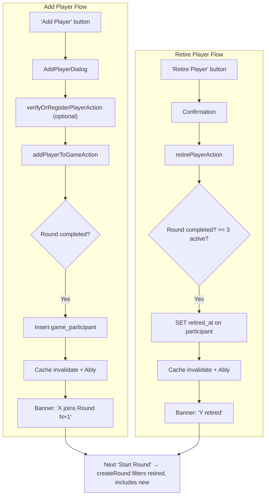

# Add and Retire Players Between Rounds

Two complementary features: adding new players to a game session and retiring existing players, both restricted to the between-rounds window.

Adding a player requires **no schema change**. Retiring requires adding a `retiredAt` column to `game_participants` (soft-delete). Both features also expose a latent stats bug that needs fixing.

---

## 0. Schema Change: `retiredAt` on `game_participants`

**File:** [src/db/schema.ts](src/db/schema.ts)

Add a nullable timestamp to the existing table definition:

```ts
retiredAt: timestamp("retired_at"),
```

After updating the schema, run `drizzle-kit push` (the project's standard DB sync approach -- no checked-in migrations).

The `SelectGameParticipant` type auto-derives from the table definition, so all downstream types (`ParticipantWithPlayer`, etc.) will gain `retiredAt: Date | null` automatically.

---

## 1. Server Action: `addPlayerToGameAction`

**File:** [src/app/actions.ts](src/app/actions.ts)

A new server action that:
- Requires game auth (`requireGameAuth`)
- Validates the latest round is **completed** (between-rounds guard) via `getLatestRound`
- Checks the player name is not a duplicate of existing **active** participants
- Resolves the player identity using the same 3-way logic as `createGameAction`:

| Input | Result |
|-------|--------|
| `playerId` set (verified existing user) | `createRegisteredParticipant(sessionId, playerId)` |
| `playerPassword` set + name available | `createPlayer` + `createRegisteredParticipant` (new registration) |
| Neither | `createGuest` + `createGuestParticipant` (guest) |

- Invalidates cache tags (`gameSessionTag`, `ALL_GAMES_TAG`) and publishes Ably update
- Returns `{ success: true; participantId: number }` or `{ success: false; error: string }`

Reuses existing DB helpers from [src/db/queries/gameParticipants.ts](src/db/queries/gameParticipants.ts) and the existing `verifyOrRegisterPlayerAction` for the client-side verify flow.

---

## 2. Server Action: `retirePlayerAction`

**File:** [src/app/actions.ts](src/app/actions.ts)

A new server action that:
- Requires game auth (`requireGameAuth`)
- Validates the latest round is **completed** (between-rounds guard)
- Validates retiring would not drop **active** participant count below 3
- Sets `retiredAt = new Date()` on the target `game_participants` row
- Invalidates cache tags and publishes Ably update
- Returns `{ success: true }` or `{ success: false; error: string }`

**New DB helper** in [src/db/queries/gameParticipants.ts](src/db/queries/gameParticipants.ts):

```ts
export async function retireParticipant(participantId: number) {
  // UPDATE game_participants SET retired_at = now() WHERE id = participantId
}
```

---

## 3. Filter Retired Players in `createRound`

**File:** [src/lib/game-service.ts](src/lib/game-service.ts)

In the `createRound` function, filter out retired participants when building the player order:

```210:211:c:\Users\David\source\repos\three-dice-game\src\lib\game-service.ts
  const allParticipantIds = participants.map((p) => p.id);
```

Change to:

```ts
const activeParticipants = participants.filter((p) => !p.retiredAt);
const allParticipantIds = activeParticipants.map((p) => p.id);
```

Also guard the starting-player selection: if the previous round's loser has since retired, fall back to the first active participant.

---

## 4. Fix Stats Bug: "Rounds Won" Over-Counting

**File:** [src/lib/game-helpers.ts](src/lib/game-helpers.ts)

The current code at line 267 counts **all** `session.participants` who aren't losers as "winners" of each round. This is incorrect for players who weren't in the round at all (late joiners or already-retired players).

Fix: only count a participant as winning if they were in that round's `playerOrder`:

```ts
// Current (buggy):
for (const p of session.participants) {
  if (!round.losingParticipantIds.includes(p.id)) { ... }
}

// Fixed:
for (const pid of round.playerOrder) {
  if (!round.losingParticipantIds.includes(pid)) {
    const s = statsMap.get(pid);
    if (s) s.roundsWon += 1;
  }
}
```

This fix is needed for correctness regardless of which feature ships first.

---

## 5. New Component: `AddPlayerDialog`

**File:** `src/components/game-session/add-player-dialog.tsx` (new)

A dialog mirroring the per-player row from [new-game-form.tsx](src/components/new-game-form.tsx) but for a single player:

- **Name input** (required, max 30 chars)
- **Password input** (optional -- for profile registration/login)
- **Verify indicator** inline (same pattern: idle/verifying/verified/available/wrong_password/invalid_username)
- On blur/Enter of password field: calls `verifyOrRegisterPlayerAction(name, password)`
- **"Add Player" submit button** calls `addPlayerToGameAction`
- Client-side validation: name not empty, name not duplicate of existing active participants (passed as prop)
- Toast feedback on success and error

Uses the existing `Dialog` component from [src/components/ui/dialog.tsx](src/components/ui/dialog.tsx). Extract the `VerifyIndicator` from `new-game-form.tsx` into a shared location so both forms can use it.

---

## 6. Integration: `RoundCompleteCard`

**File:** [src/components/game-session/round-complete-card.tsx](src/components/game-session/round-complete-card.tsx)

Add "Add Player" and "Retire Player" controls plus notification banners:

```
  [Round outcome banner]
  [Turn results list]
  ── separator ──
  [+ Add Player]                                  <-- opens AddPlayerDialog
  [Retire Player: dropdown of active players]     <-- with confirmation
  [info banner: "X will join in Round N"]         <-- after adding
  [info banner: "Y has been retired"]             <-- after retiring
  ══ separator ══
  [Start Round N+1]
```

- **Add Player button**: opens `AddPlayerDialog`
- **Retire Player**: a secondary button/dropdown listing active non-owner participants. Clicking shows a confirmation prompt, then calls `retirePlayerAction`. Disabled if only 3 active participants remain.
- **Info banners** (styled like the existing tiebreaker-winner banner):
  - Added players: `UserPlus` icon, blue/primary border: "[Name] will join in Round {N+1}"
  - Retired players: `UserMinus` icon, muted border: "[Name] has been retired"
- Banner state tracked in `RoundCompleteCard` local state, reset on `round.id` change. Page re-renders with updated `participants` from the server after cache invalidation.

New prop needed: `gameSessionId` (flows from `PlayerTurnCard`).

---

## 7. Visual Indicators for Retired Players

Retired players should still appear in displays (they have historical data) but with a visual indicator:

- **[game-state-card.tsx](src/components/game-session/game-state-card.tsx)**: Show a "Retired" badge next to the player name in the leaderboard. Dim/mute their stats row.
- **[game-summary-card.tsx](src/components/game-session/game-summary-card.tsx)**: Same "Retired" badge in the final standings. They still appear in the leaderboard and can still win awards.
- **[award-sips-dialog.tsx](src/components/game-session/award-sips-dialog.tsx)**: Filter the target list to only show players in the **current round's `playerOrder`** (already correct for retired players since they won't be in `playerOrder`, but should be explicit).

---

## Data Flow



---

## Files Changed

| File | Change |
|------|--------|
| [src/db/schema.ts](src/db/schema.ts) | Add `retiredAt` column to `game_participants` |
| [src/db/queries/gameParticipants.ts](src/db/queries/gameParticipants.ts) | Add `retireParticipant` helper |
| [src/app/actions.ts](src/app/actions.ts) | Add `addPlayerToGameAction` and `retirePlayerAction` |
| [src/lib/game-service.ts](src/lib/game-service.ts) | Filter retired players in `createRound` |
| [src/lib/game-helpers.ts](src/lib/game-helpers.ts) | Fix "rounds won" to check `playerOrder` membership |
| `src/components/game-session/add-player-dialog.tsx` | New: single-player add form dialog |
| [src/components/game-session/round-complete-card.tsx](src/components/game-session/round-complete-card.tsx) | Add/Retire buttons, info banners, `gameSessionId` prop |
| [src/components/game-session/player-turn-card.tsx](src/components/game-session/player-turn-card.tsx) | Pass `gameSessionId` to `RoundCompleteCard` |
| [src/components/game-session/game-state-card.tsx](src/components/game-session/game-state-card.tsx) | "Retired" badge on retired players |
| [src/components/game-session/game-summary-card.tsx](src/components/game-session/game-summary-card.tsx) | "Retired" badge in final standings |
| [src/components/game-session/award-sips-dialog.tsx](src/components/game-session/award-sips-dialog.tsx) | Filter targets to current round's `playerOrder` |
